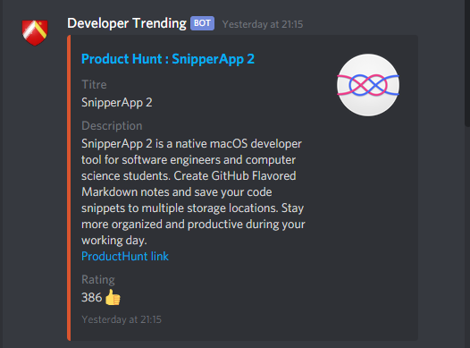
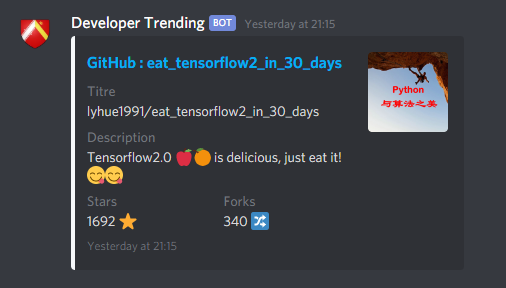
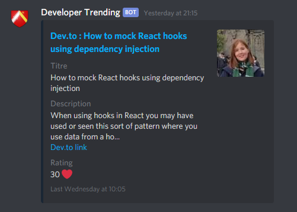
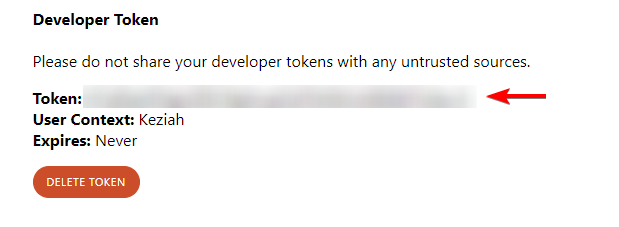
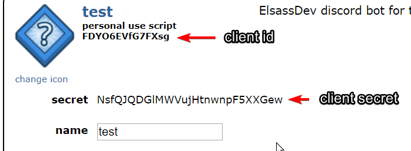

# trending-bot
Receive trending content directly on Discord.

---

## Preview






## Installation

### Prerequisites

* Have [Node.js](https://nodejs.org/en/)  installed (> 10)

### Steps

1. Clone the repository
```sh
$ git clone https://github.com/ElsassDev/trending-bot.git
```

2. Install dependencies :
```sh
$ npm install
```

3. Run

```sh
$ npm start
```

## Setup modules

### ProductHunt

1. Go to https://api.producthunt.com/v2/oauth/applications
2. Create an application
3. Create a developer token
4. Set the `Token` to the `TOKEN_PRODUCTHUNT` environment variable




### Reddit

1. Go to https://www.reddit.com/prefs/apps
2. Create a `script` app
3. Set the `client id` to the `REDDIT_CLIENT_ID` environment variable
4. Set the `secret` to the `REDDIT_CLIENT_SECRET` environment variable
5. Set your Reddit username to the `REDDIT_USERNAME` environment variable
6. Set your Reddit password to the `REDDIT_PASSWORD` environment variable




### GitHub

Nothing to do, it scrapes the trending page.

### Dev.to

Nothing to do, it uses the public API endpoint `https://dev.to/api/articles`